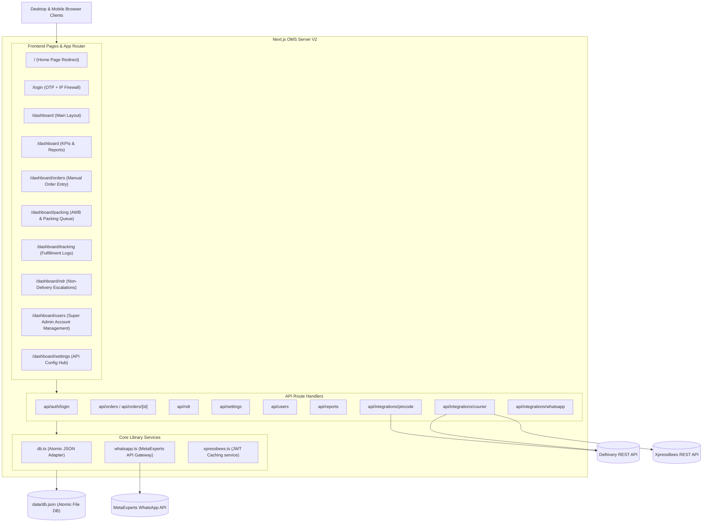
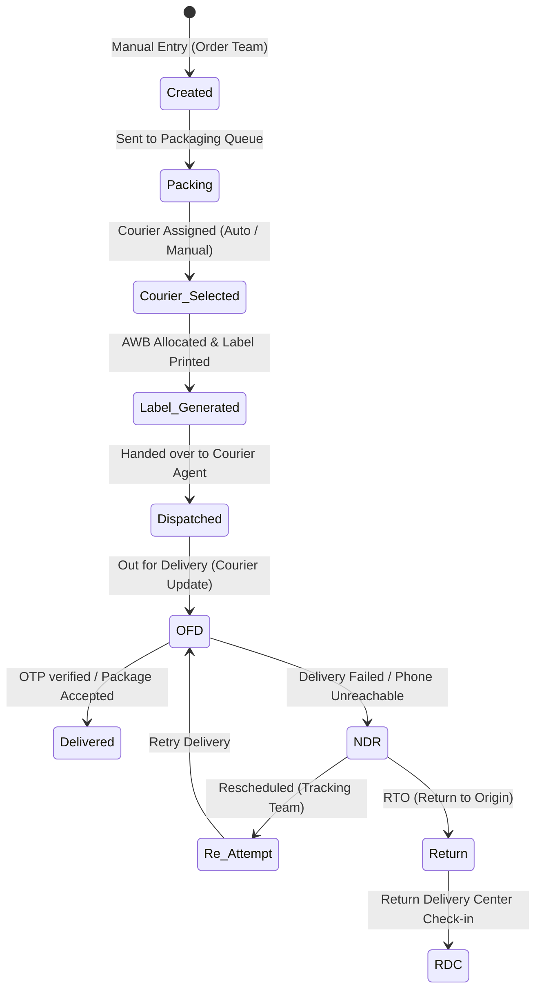

# Technical Documentation: 99Store Order Management System (OMS)

Welcome to the technical and architectural documentation of the **99Store Order Management System (OMS)**. This web-based software is a premium, minimal dashboard application designed to streamline the complete lifecycle of order processing, packing, shipping agency routing, live dispatch tracking, WhatsApp customer automation, and Non-Delivery Report (NDR) case escalations.

---

## 1. System Architecture

The application is built using a modern full-stack TypeScript framework with a decoupled architecture. Below is a high-level architectural block diagram showing client, route handler, and data persistence connections:



---

## 2. Technology Stack & Directory Structure

The project utilizes the following core technology layers:
1. **Core Runtime**: [Next.js v16.2.6](file:///c:/Users/OMK%20Developer/Downloads/99StoreOMSV2/package.json#L13) and [React v19.2.4](file:///c:/Users/OMK%20Developer/Downloads/99StoreOMSV2/package.json#L14) with TypeScript.
2. **Styling**: Vanilla CSS structure via CSS variables and utility classes defined inside [globals.css](file:///c:/Users/OMK%20Developer/Downloads/99StoreOMSV2/src/app/globals.css), following a premium dark-themed minimalist aesthetics palette.
3. **Database**: Lightweight, thread-safe JSON-based atomic flat-file database located at `data/db.json`.
4. **Icons**: [lucide-react](file:///c:/Users/OMK%20Developer/Downloads/99StoreOMSV2/package.json#L12) vector graphics library.

### Key File Mapping

*   **System Layouts & Routing Rules**:
    *   [globals.css](file:///c:/Users/OMK%20Developer/Downloads/99StoreOMSV2/src/app/globals.css): CSS variables for colors (Paid green, VIP amber, status tags), global reset, cards, premium inputs, buttons, tables, badges, modals, and responsive grids.
    *   [layout.tsx](file:///c:/Users/OMK%20Developer/Downloads/99StoreOMSV2/src/app/layout.tsx): Root layout adding metadata headers and importing global styles.
    *   [page.tsx](file:///c:/Users/OMK%20Developer/Downloads/99StoreOMSV2/src/app/page.tsx): Entry checkpoint redirecting users based on active session storage.
*   **Frontend Modules (Dashboard Area)**:
    *   [login/page.tsx](file:///c:/Users/OMK%20Developer/Downloads/99StoreOMSV2/src/app/login/page.tsx): OTP login entry containing quick-switch demo profiles, IP whitelist triggers, and local testing overrides.
    *   [dashboard/layout.tsx](file:///c:/Users/OMK%20Developer/Downloads/99StoreOMSV2/src/app/dashboard/layout.tsx): App shell sidebar. Contains a **Reviewer Bar** at the top allowing developer/evaluator role switching on-the-fly to test view configurations.
    *   [dashboard/page.tsx](file:///c:/Users/OMK%20Developer/Downloads/99StoreOMSV2/src/app/dashboard/page.tsx): Status metrics, charts, courier performance graphs, and log export utilities.
    *   [dashboard/orders/page.tsx](file:///c:/Users/OMK%20Developer/Downloads/99StoreOMSV2/src/app/dashboard/orders/page.tsx): Order Entry terminal with automatic pincode lookup and VIP tags.
    *   [dashboard/packing/page.tsx](file:///c:/Users/OMK%20Developer/Downloads/99StoreOMSV2/src/app/dashboard/packing/page.tsx): Workspace to package orders and auto-assign courier AWBs.
    *   [dashboard/tracking/page.tsx](file:///c:/Users/OMK%20Developer/Downloads/99StoreOMSV2/src/app/dashboard/tracking/page.tsx): Delivery monitoring log showing raw courier API payloads.
    *   [dashboard/ndr/page.tsx](file:///c:/Users/OMK%20Developer/Downloads/99StoreOMSV2/src/app/dashboard/ndr/page.tsx): Non-Delivery Report dashboard containing tools to schedule delivery re-attempts.
    *   [dashboard/users/page.tsx](file:///c:/Users/OMK%20Developer/Downloads/99StoreOMSV2/src/app/dashboard/users/page.tsx): User details and role toggles.
    *   [dashboard/settings/page.tsx](file:///c:/Users/OMK%20Developer/Downloads/99StoreOMSV2/src/app/dashboard/settings/page.tsx): Live API credential configurations and firewall switches.
*   **Backend & Library Adapters**:
    *   [types.ts](file:///c:/Users/OMK%20Developer/Downloads/99StoreOMSV2/src/lib/types.ts): Data contract model definitions.
    *   [db.ts](file:///c:/Users/OMK%20Developer/Downloads/99StoreOMSV2/src/lib/db.ts): Atomically synchronized read/write functions for flat-file JSON management.
    *   [mockData.ts](file:///c:/Users/OMK%20Developer/Downloads/99StoreOMSV2/src/lib/mockData.ts): Default seed datasets.
    *   [whatsapp.ts](file:///c:/Users/OMK%20Developer/Downloads/99StoreOMSV2/src/lib/whatsapp.ts): MetaExperts WhatsApp message dispatcher.
    *   [xpressbees.ts](file:///c:/Users/OMK%20Developer/Downloads/99StoreOMSV2/src/lib/xpressbees.ts): Auth token retriever with a 12-hour memory cache.

---

## 3. Database Schema

All system tables map to collections inside the flat file DB `data/db.json`. The records are managed through the database adapter methods in [db.ts](file:///c:/Users/OMK%20Developer/Downloads/99StoreOMSV2/src/lib/db.ts).

### 3.1 Order Schema
Maps to the typescript interface [Order](file:///c:/Users/OMK%20Developer/Downloads/99StoreOMSV2/src/lib/types.ts#L38).

| Field | Type | Description |
|---|---|---|
| `id` | `string` | Internal UUID |
| `orderId` | `string` | Human-visible customer order code (e.g., `99S-1001`) |
| `customerName` | `string` | Full name of client recipient |
| `phonePrimary` | `string` | Main contact number (prefixed with `91` on dispatch API calls) |
| `phoneSecondary` | `string` (optional) | Alternate phone number |
| `phoneTertiary` | `string` (optional) | Alternate fallback phone number |
| `address` | `string` | Delivery physical address |
| `pincode` | `string` | 6-digit destination postal code |
| `state` | `string` | Region state (mapped during pincode API fetch) |
| `area` | `string` | Local city / hub region |
| `productDetails`| `string` | Summary description of purchased products |
| `paymentType` | `'COD' \| 'Paid'` | Payment method. Generates green highlighters if `Paid`. |
| `orderValue` | `number` | Total invoice sum |
| `weight` | `number` | Order weight in kilograms |
| `isVip` | `boolean` | Flags a gold star next to the customer's name |
| `status` | `OrderStatus` | Current routing stage (see order flow list below) |
| `awb` | `string` (optional) | Courier Air Waybill tracker number |
| `courier` | `'DTDC' \| 'XpressBees' \| 'Delhivery' \| 'Aggregator'` | Chosen shipping carrier |
| `eta` | `string` (optional) | Estimated arrival date |
| `createdBy` | `string` | Creator account username |
| `history` | `OrderHistory[]` | Transaction logs tracking state changes, editors, and remarks |

### 3.2 User Schema
Maps to the typescript interface [User](file:///c:/Users/OMK%20Developer/Downloads/99StoreOMSV2/src/lib/types.ts#L8).

| Field | Type | Description |
|---|---|---|
| `id` | `string` | Unique User UUID |
| `username` | `string` | Login username |
| `name` | `string` | Display name |
| `role` | `UserRole` | Operational clearance rank |
| `isActive` | `boolean` | Connection block toggle |
| `lastLoginIp` | `string` (optional) | Last registered login network address |

### 3.3 NDR Record Schema
Maps to the typescript interface [NdrRecord](file:///c:/Users/OMK%20Developer/Downloads/99StoreOMSV2/src/lib/types.ts#L71).

| Field | Type | Description |
|---|---|---|
| `id` | `string` | NDR case UUID |
| `orderId` | `string` | Connected order number |
| `customerName` | `string` | Customer name |
| `phonePrimary` | `string` | Contact phone |
| `courier` | `string` | Carrier name |
| `awb` | `string` | Waybill tracking code |
| `reason` | `string` | Delivery exception explanation from the carrier |
| `status` | `'Pending' \| 'Re-attempt Scheduled' \| 'Returned to Origin'` | Escalation status |
| `reattemptDate`| `string` (optional) | Target date for courier retry |
| `internalNotes`| `string` | Escalation notes added by the tracking agent |

---

## 4. User Access Controls (RBAC) & Security

The system employs **Role-Based Access Control (RBAC)** across frontend panels and endpoint systems. There are five clear [UserRole](file:///c:/Users/OMK%20Developer/Downloads/99StoreOMSV2/src/lib/types.ts#L1) types defined:

1.  **Super Admin**: Holds full permissions. Accesses API integrations, user accounts, and database configurations.
2.  **Order Team**: Permissions for manual order creation, editing customer details, and monitoring status reports.
3.  **Packing Team**: Manages the packing queue, prints labels, selects couriers, and books shipments.
4.  **Tracking Team**: Monitors transit statuses, tracks courier API payloads, and resolves NDR exceptions.
5.  **Accounts Team**: Reviews reports, inspects COD collections vs. prepaid statuses, and verifies invoices.

### 4.1 UI Access Matrix
Restricted links are blocked at layout levels inside [dashboard/layout.tsx](file:///c:/Users/OMK%20Developer/Downloads/99StoreOMSV2/src/app/dashboard/layout.tsx#L72):

| Route / Panel | Path Link | Super Admin | Order Team | Packing Team | Tracking Team | Accounts Team |
|---|---|:---:|:---:|:---:|:---:|:---:|
| **Dashboard & KPI Reports** | `/dashboard` | ✅ | ✅ | ✅ | ✅ | ✅ |
| **Order Entry & Edit** | `/dashboard/orders` | ✅ | ✅ | ❌ | ❌ | ✅ |
| **Packing & Courier Select** | `/dashboard/packing` | ✅ | ❌ | ✅ | ❌ | ❌ |
| **Fulfillment & Dispatch** | `/dashboard/tracking` | ✅ | ❌ | ❌ | ✅ | ❌ |
| **NDR & OFD Escalations** | `/dashboard/ndr` | ✅ | ❌ | ❌ | ✅ | ❌ |
| **User Management** | `/dashboard/users` | ✅ | ❌ | ❌ | ❌ | ❌ |
| **API Settings Hub** | `/dashboard/settings` | ✅ | ❌ | ❌ | ❌ | ❌ |

### 4.2 Security Firewall
*   **IP Whitelist**: Enabled via [SystemSettings](file:///c:/Users/OMK%20Developer/Downloads/99StoreOMSV2/src/lib/types.ts#L110). When turned on, the system verifies `x-forwarded-for` or `x-real-ip` headers during login requests inside [route.ts](file:///c:/Users/OMK%20Developer/Downloads/99StoreOMSV2/src/app/api/auth/login/route.ts#L26). Non-whitelisted IPs receive an HTTP `403 Forbidden` response.
*   **Demo Whitelist Bypass**: A client-side option is provided on the blocked modal to allow local reviewers and developers to easily bypass this check when testing locally.
*   **OTP Verification**: The login flow requires a 6-digit OTP code. In the current development environment, the gateway accepts `999999` (or any valid 6-digit numeric pattern) for ease of demo navigation.

---

## 5. Main Functional Modules

### 5.1 Order Workflow
Orders pass through distinct operational milestones inside the OMS system:



### 5.2 Auto-Courier Selection logic
During the packing phase, if `autoCourierEnabled` is active in settings, the system executes an automated routing logic inside [packing/page.tsx](file:///c:/Users/OMK%20Developer/Downloads/99StoreOMSV2/src/app/dashboard/packing/page.tsx) to identify the best shipment carrier:
1.  **Weight-based Routing**:
    *   Orders under **1.0 kg** default to **DTDC** (configured as highest priority for lightweight surface courier parcels).
    *   Orders between **1.0 kg and 2.0 kg** default to **XpressBees**.
    *   Orders exceeding **2.0 kg** default to **Delhivery** (or the Aggregator API).
2.  **Config Priority Override**: If specific carriers are disabled insettings, the auto-router shifts down the active list using the configured priorities.

### 5.3 Pincode Area Auto-Fetcher
When an Order Team agent inputs a pincode in the Order Entry form, an API call queries [api/integrations/pincode](file:///c:/Users/OMK%20Developer/Downloads/99StoreOMSV2/src/app/api/integrations/pincode/route.ts):
1.  **Live Check**: If Delhivery is active and has a configured API Key, the endpoint calls Delhivery's live serviceability database (`/c/api/pin-codes/json/?filter_codes=`).
2.  **Internal Database**: If live serviceability is offline, it checks the local mapping index (`pincodeMap`).
3.  **Zone Fallback**: If the pincode is completely new, it automatically parses the first digit (postal zone) and resolves a fallback region:
    *   `1xxxx` $\rightarrow$ Delhi/NCR
    *   `2xxxx` $\rightarrow$ Uttar Pradesh
    *   `3xxxx` $\rightarrow$ Gujarat
    *   `4xxxx` $\rightarrow$ Maharashtra
    *   `5xxxx` $\rightarrow$ Karnataka/Andhra Pradesh
    *   `6xxxx` $\rightarrow$ Tamil Nadu/Kerala
    *   `7xxxx` $\rightarrow$ West Bengal/NorthEast
    *   `8xxxx` $\rightarrow$ Bihar/Jharkhand

### 5.4 WhatsApp Notification Gateway
Integrated via [whatsapp.ts](file:///c:/Users/OMK%20Developer/Downloads/99StoreOMSV2/src/lib/whatsapp.ts), status transitions trigger automated templates sent to MetaExperts API.

```
Recipient Number Sanitization:
- Trims non-digits.
- Appends "91" if length is exactly 10 digits.
- Discards invalid phone lengths (<11 or >15 digits).
```

*   **Primary Contact Messages**:
    *   `Created`: Confirms receipt of order, invoice totals, and prepaid status.
    *   `Dispatched`: Sends tracking link, courier identifier, and estimated delivery date.
    *   `OFD`: Triggers Out for Delivery warning asking customer to stay reachable.
    *   `Delivered`: Confirms final payment validation or COD collection.
    *   `NDR`: Alerts the buyer of a failed delivery attempt and lists contact links.
    *   `Return/RDC`: Details tracking updates for packages returning back to origin (RTO).
*   **Secondary Contact Messages**:
    *   Sends matching summaries to alternate contacts to ensure delivery rates remain high.

---

## 6. Live API Integrations

The OMS system supports live integration modes for **Delhivery** and **XpressBees** APIs. If API keys are set to `'MOCK'` or mock credentials, the systems run simulated sandboxes.

### 6.1 Delhivery Integration
API endpoints connect to the staging (`staging-express.delhivery.com`) or production (`track.delhivery.com`) networks.
1.  **AWB Allocation**: Requests a single waybill number from the waybill retrieval system:
    `GET /waybill/api/fetch/json/?token={{token}}&cl={{clientName}}&client_name={{clientName}}`
2.  **Shipment Creation (CMU Manifest)**: Books the shipping order:
    `POST /api/cmu/create.json`
    Payload formatted as form url-encoded with JSON content: `format=json&data={ shipments: [...] }`
3.  **Label Generation**: Fetches packing slip PDF data:
    `GET /api/p/packing_slip?wbns={{waybill}}`
4.  **Tracking**: Fetches shipment logs:
    `GET /api/v1/packages/json/?token={{token}}&waybill={{waybill}}`

### 6.2 XpressBees Integration
1.  **JWT Authentication**: Fetches a bearer token from:
    `POST /api/users/login` (body: `{ email, password }`). Token is cached for **12 hours** to optimize API usage.
2.  **Shipment Booking**:
    `POST /api/shipments2` (Payload: JSON containing order number, consignee data, pickup address, and dimensions).
3.  **Cancellation**:
    `POST /api/shipments2/cancel` (Payload: `{ awb: waybill }`).
4.  **Manifesting**:
    `POST /api/shipments2/manifest` (Payload: `{ awbs: [waybill] }`).
5.  **Reverse Pickup Booking**:
    `POST /api/Reverseshipments`.

---

## 7. Local Development Guide

### 7.1 Setup Requirements
1.  Install dependencies:
    ```bash
    npm install
    ```
2.  Ensure local file read/write permissions are available for the `data/db.json` file. The database creates a backup copy (`db.json.tmp`) before writing atomically.

### 7.2 Running Development Server
Start the Next.js development server:
```bash
npm run dev
```
Open [http://localhost:3000](http://localhost:3000) in your browser.

### 7.3 Testing Roles and Operations
*   Login as `admin` to access the full system.
*   Once logged in, look at the **Reviewer Bar** at the top of your screen to switch role context instantly and verify UI limits and permissions.
*   Check the [Delhivery 99Store Manual Setup.md](file:///c:/Users/OMK%20Developer/Downloads/99StoreOMSV2/postman/Delhivery%2099Store%20Manual%20Setup.md) for information on importing the workspace configuration into Postman.
